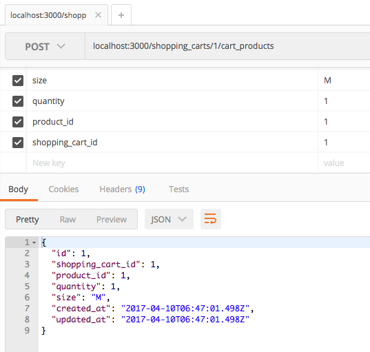
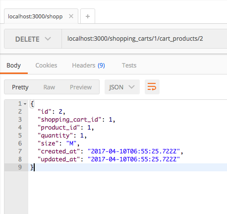
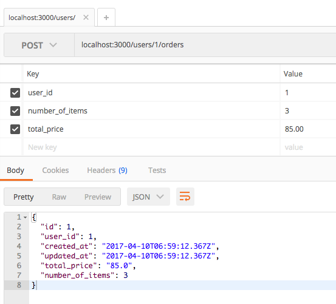
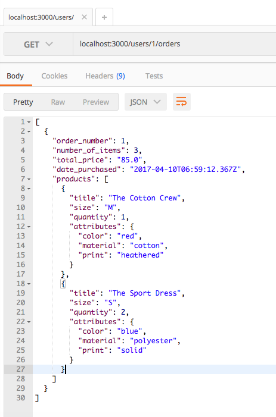
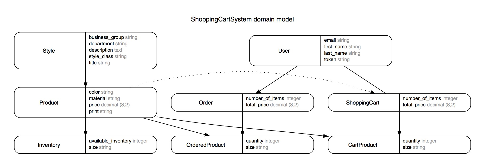

# Shopping Cart System

## Setting Up
1. Install the required gems: `bundle install`
2. Run tests: `rspec` (see note below about the tests)
3. Setup the database: `rails db:setup`

Rspec Tests:    
- Within my POST#create tests, the data is not posting correctly and is causing the associated tests to fail. However, the create methods are working correctly outside of rspec, so there is an issue with the format of the `post :create` portion. I tried many different formats, but was unable to debug it in time.
- The response from my GET request test states that "products" is empty, which is not actually the case.

(If you happen to notice what is causing the issue in either of these tests, I would greatly appreciate if you pointed it out!)

## Sending Requests   
I tested all of the following using Postman. The images show the routes and data, as well as the json responses.    
- Add a product to a cart    
    
In the rails console:    
  - `ShoppingCart.first.products` to see that a product has indeed been added to the cart
  - `ShoppingCart.first` to see that the total_price and number_of_items have increased by the appropriate amount

- Remove a product from a cart    
    
In the rails console:    
  - `ShoppingCart.first.products` to see that a product has been removed
  - `ShoppingCart.first` to see that the total_price and number_of_items have decreased by the appropriate amount

- Create an order    
    
In the rails console:    
  - `Order.last.ordered_products` to see that ordered_products were created along with the order (these are based on the products that were in the shopping cart)
  - `Inventory.find_by(product_id:1, size:"M")` to see that the inventory has decreased by the quantity of that product
  - `ShoppingCart.first.products` to see that the cart has been emptied
  - `ShoppingCart.first` to see that the total_price and number_of_items have reset to zero

- View order history    
    

## Database Structure

#### Reasoning
- Separated Shopping Cart from User  
  - Can see when the shopping cart was last updated, without the user profile also showing as updated  
- Separated Products from Styles  
  - In merchandising, one style is often reordered but with updated attributes (such as color, print, material). Depending on the changes, this can also alter the price. This is why price and specific style attributes are recorded under Product, while the overall style name and business specifics are recorded under Style.  
- Metrics measured in Style table (using Everlane as an example)  
  - department: apparel, accessories
  - style_class: tees, shirts, sweaters, dresses, bottoms, outerwear, leisure, shoes, leather_bags, backpacks, small_accessories
  - business_group: womens, mens, kids, unisex  
- Made Inventory its own table
  - Depending on the product, sizing can get very long and complicated (i.e. 00 - 16, shoe sizes). Separating inventory saves space on the Product table, and allows the inventory to continually update without affecting the product itself. Also, if a business has more than one warehouse, it is easy to scale the Inventory table by adding a "warehouse" column.  
- Connected Orders and Products with a join table
  - When viewing the purchase history, this makes it possible to see not only what products were purchased, but what products were purchased together (useful if recommending products to customers based on other's purchase history).
